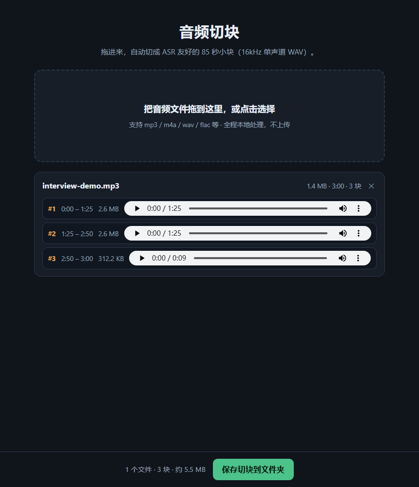

# Audio Bench · 音频切块

**拖进来，自动切成 ASR 友好的 85 秒小块。** 纯前端、纯本地、单文件。



## 为什么

给语音转写（ASR）喂音频前，几乎总要先「转单声道 16k → 按 ≤90s 切块」。
本工具把这一步做成零操作：**把音频拖进网页，块就出来了**，还能立刻试听每一块。

## 使用

1. 下载 [`index.html`](https://raw.githubusercontent.com/VFVrPQ/audio-bench/main/index.html)（约 230 KB，单文件）
2. 双击用 Chrome / Edge 打开（`file://` 可直接运行，无需服务器）
3. 拖入音频（或点击选择，支持多选）
4. 处理完成后点 **「保存切块到文件夹」** → 得到

```
<source>-chunks/
├─ manifest.json      # 每块起止时间 / 字节 / ASR 提示
├─ chunk_000.wav
├─ chunk_001.wav
└─ …
```

每个块：**16 kHz · 单声道 · 16-bit PCM WAV · ≤85 秒** —— 可直接送任意 ASR。

也支持在线使用：<https://vfvrpq.github.io/audio-bench/>

## 特性

- **零依赖运行**：单 HTML 文件，离线可用，音频不出本机
- **真切块**：WebAudio 解码 → 16 kHz 单声道重采样 → 85s 均分 → WAV 编码，全部浏览器内完成
- **边切边听**：每块内置播放器
- **一键落盘**：File System Access API 写入所选文件夹（不支持时自动回退为逐个下载）
- **通用**：不绑定任何业务，输出即标准的 ASR 预处理产物

## 开发

```bash
cd workflow-app
npm install
npm run dev      # 本地开发
npm run build    # 构建到上级目录
npm run single   # 内联为单文件 index.html
```

技术栈：Vite + React 19 + TypeScript。切块核心在
[`workflow-app/src/audio.ts`](workflow-app/src/audio.ts)（`decodeAudioData` →
`OfflineAudioContext` 重采样 → 手写 WAV 编码）。

## License

MIT
